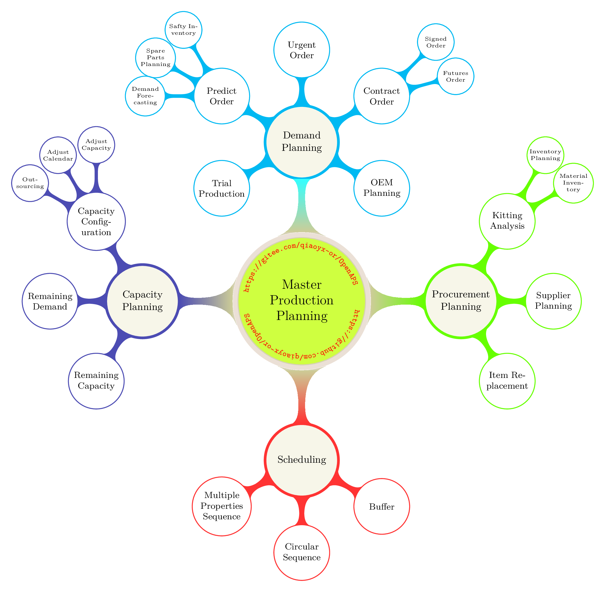
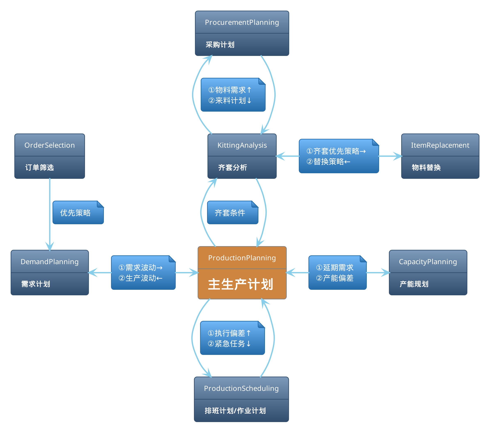
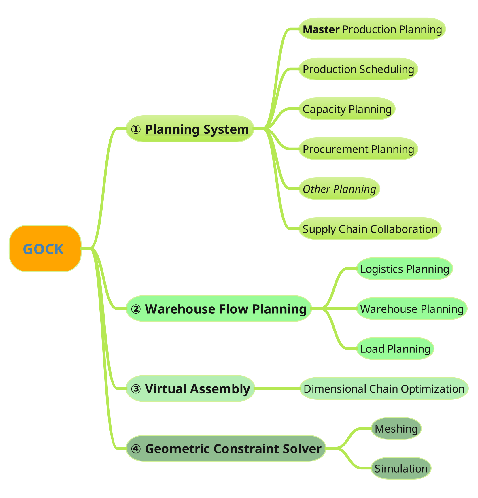

# en [English](README.en.md)
# [项目文档](Docs/OpenAPS.pdf)

# 什么是 APS
APS(Advanced Planning and Scheduling, 高级计划与排程)是一种用于优化和管理制造、物流和其他复杂运营过程的系统。它旨在通过综合考虑多种因素和约束条件，生成高效、可行的计划和排程，从而提高企业的运营效率和资源利用率

# OpenAPS
## 项目目标

<ol>
    <li>促进APS的普及</li>
    <li>提供高效的工具帮助企业在生产场景中做出科学决策</li>
    <li>打破传统APS系统实施的复杂性——完成数据配置即可使用</li>
    <li>结合专用数学模型与约束求解实现可靠优化</li>
    <li>探索APS的最佳实践</li>
    <li>供参考与学习</li>
</ol>

## 项目特点
通过构建约束优化数学模型来表示实际的规划/决策问题

## 项目动机
OpenAPS是针对当前APS在应用和实施过程中面临的以下问题制定的一种解决方案:

|   |                                                                   |
|:--|:------------------------------------------------------------------|
| 1 | 系统众多，但缺乏具有针对性的数学模型及合适的算法                  |
| 2 | 实施的复杂性高, 包括项目周期长，项目效果不确定等问题              |
| 3 | 过于侧重流程协同，缺失优化与协同的结合，导致协同效果不理想        |
| 4 | APS易退化为高定制化的信息系统，难以应对变化甚至失效 |
| 5 | 优化过程的人机交互性不足，导致解算逻辑与实际情况难以达成一致      |

## 整体方案
全局协同 & 决策优化



## 应用场景
<ol>
    <li>计划制定</li>
    <ol>
        <li>主生产计划</li>
        <li>作业计划/生产排班</li>
        <li>产能规划</li>
        <li>物料需求分析</li>
    </ol>
    <li>多计划协同</li>
    <ol>
        <li>主生产计划与作业计划协同</li>
        <li>主生产计划与采购计划协同</li>
        <li>主生产计划与产能规划协同</li>
    </ol>
    <li>供应链协同</li>
</ol>

## Getting started
    第一次克隆该仓库时，需要更新子模块：
    ```
    git submodule update --init --recursive
    ```

## 项目结构
|   | 子模块                     | 描述                                     |
|:--|:---------------------------|:-----------------------------------------|
| 1 | Application                | 各类场景及应用                           |
| 2 | DataSets                   | 公共数据集                               |
| 3 | Interface                  | 数据接口                                 |
| 4 | Optimizationcalculuskernel | 优化运算核，提供规划所需的数学模型与算法 |

## 关于 GOCK

GOCK is a Mathematical Programming and Constraint Solving Tools for Industrial software


